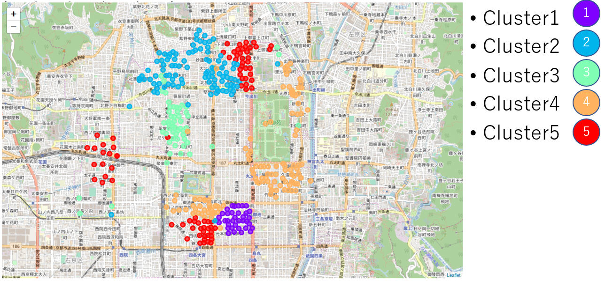
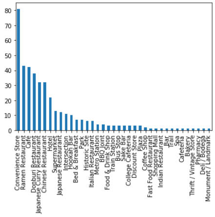
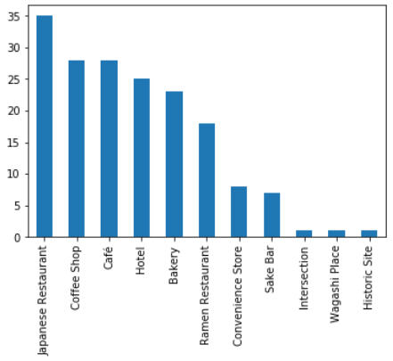
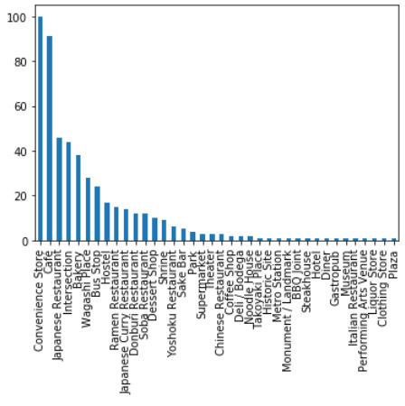
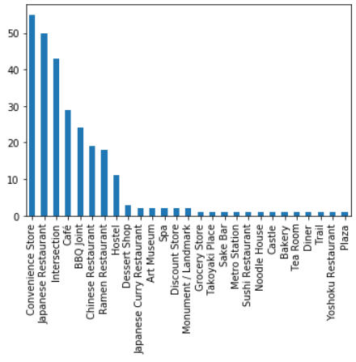
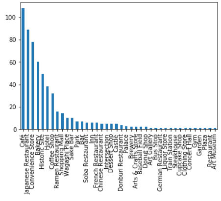

# Recommending place for setting up travel agency office for tourists visting Kyoto

## Introduction/Business Problem

Kyoto is one of the oldest city in Japan and there are quite a lot of historical structures. It attracts many foreign tourists every year.

If someone is looking to open a travel agency with local guide service for the tourists, where would be recommended that they setup their office?

## Data

We use the following 4 data for analysis.

### Japan postal code

First of all, we need address data of Kyoto city.
We use [postal code data](https://www.post.japanpost.jp/zipcode/dl/roman/ken_all_rome.zip?190712) distributed from Japan Post Corporation.

The postal code data is in CSV format with the following columns.

1. zip code
2. prefecture (Japanese)
3. borough (Japanese)
4. neighborhood (Japanese)
5. prefecture (English)
6. borough (English)
7. neighborhood (English)

### [geopy](https://geopy.readthedocs.io/)

The postal code data does not have coordinates. So we use [geopy](https://geopy.readthedocs.io/) library to look up them from `prefecture (Japanese)`, `borough (Japanese)`, and `neighborhood (Japanese)` in the postal code data.

### [Folium location data](https://python-visualization.github.io/folium/)

After getting the coordinates of each neighborhood, we use [Folium location data](https://python-visualization.github.io/folium/) to plot them and explore locations on map.

### [Foursquare API](https://api.foursquare.com)

To get the characteristics of neighborhoods, we use [Foursquare API](https://api.foursquare.com) to see venues information near by them.

## Methodology

Now we have the location data for Kyoto city with the following 9 columns.

1. zip code
2. prefecture (Japanese)
3. borough (Japanese)
4. neighborhood (Japanese)
5. prefecture (English)
6. borough (English)
7. neighborhood (English)
8. latitude
9. longitude

In addition to that, we have venues information near by the neighborhoods.

We would like to see the characteristics of locations and find out where would be the best area to open a new office.

So we take the following steps.

1. Group venues by neighborhood and by taking the mean of the frequency of occurrence of each category
2. Get the top 10 venues for each neighborhood
3. Cluster neighborhoods by venues and get the top 10 venues for each neighborhood. The venues information do not have hierarchical structures. So `k-means clustering` is suitable for the purpose.
4. Visualize the clusters on map
5. Examine the clusters to see their characteristics. Plot common venues of each cluster.

## Results

The neighborhoods clustered by venues become as follows.

Clusters

### Common venues of each cluster

Cluster1

Cluster2

Cluster3

Cluster4

Cluster5

## Discussion

For a travel agency with local guide service for the tourists, the office should be located in areas where many tourists come and stay for long hours. Such areas should have hotels (including hostel, bed & breakfast), cafe, and convenient stores. From looking the bar plot of clusters, the cluster 1, 2, 3, and 4 have them. Among those four clusters, the cluster 1 and 4 have metro stations, and the cluster 3 has bus stops. It indicates those areas are easier for tourists to access. By further examining those areas on the map, we can find the cluster 1 is close to a famous world heritage site [Nojo-jo Castle](http://nijo-jocastle.city.kyoto.lg.jp/?lang=en). It means the cluster 1 is more attractive area for the tourists.

## Conclusion

We recommend to open a travel agency office in the area of cluster 1. For example,

- AMAGASAKIYOKOCHO
- UCHIGAMAECHO
- URATSUKIJICHO
- URAFUROCHOOKAMATSUCHO
